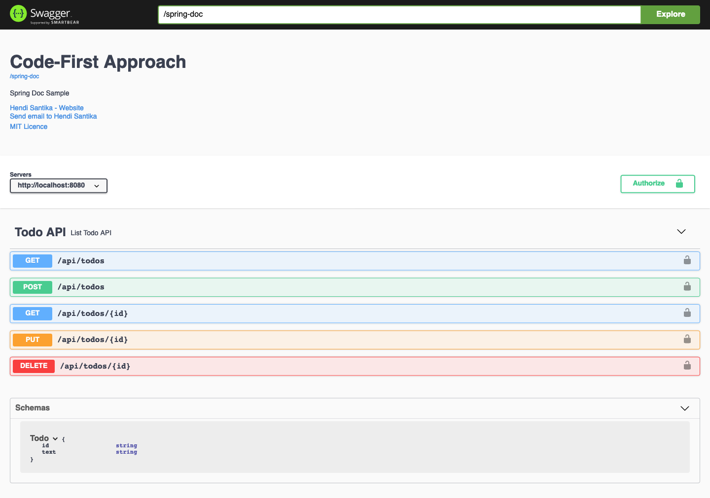
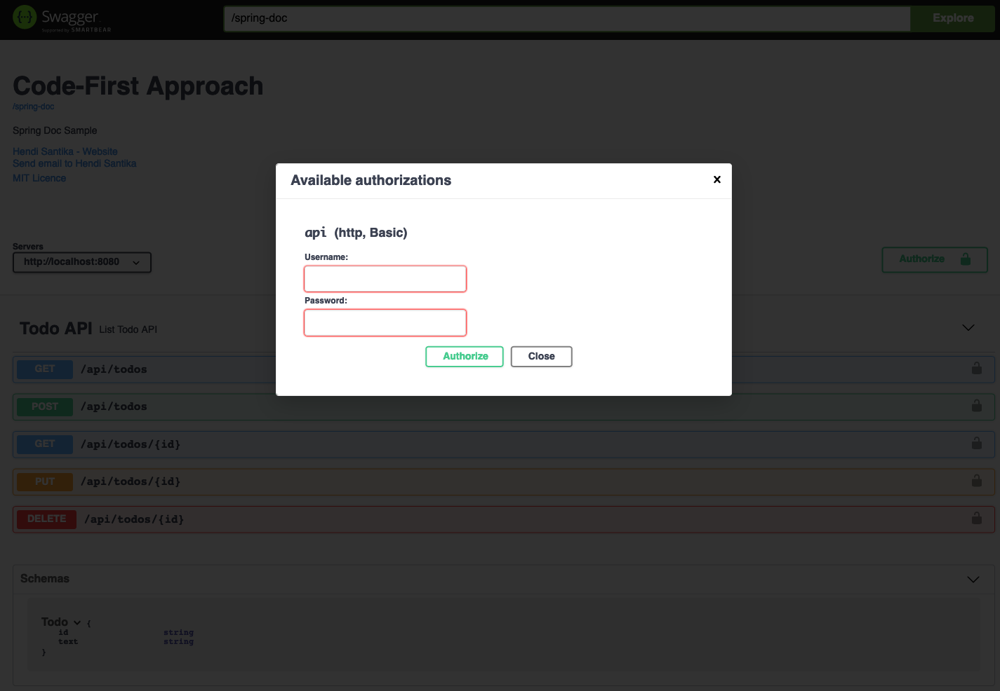
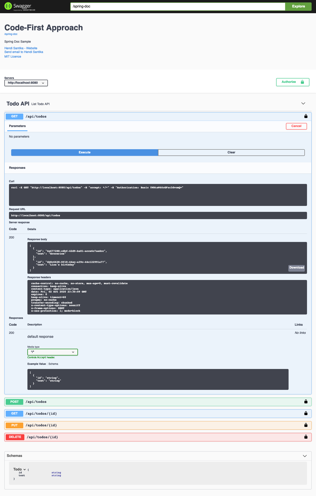
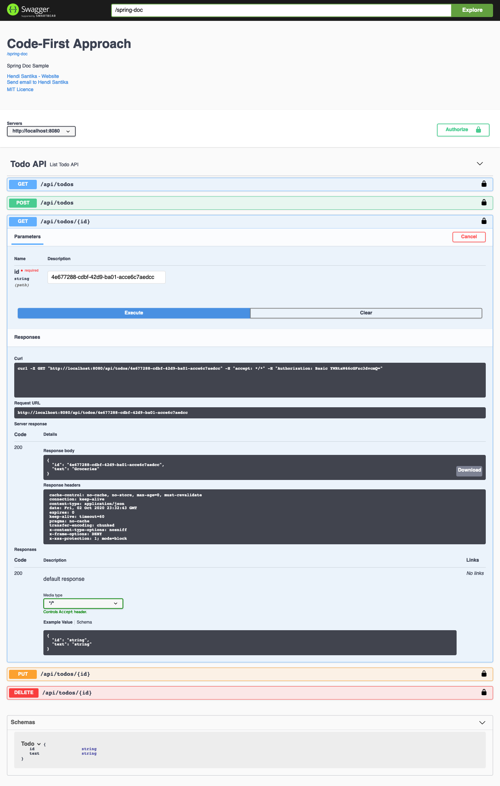

# springdoc-sample
## Things todo list
1. Clone this repository: `git clone https://github.com/hendisantika/springdoc-sample.git`
2. Go inside the folder: `cd springdoc-sample`
3. Run the application: `gradle clean bootRun`
4. Open your favorite browser: http://localhost:8080/swagger-ui/index.html?configUrl=/spring-doc/swagger-config#/

## Screen shot

Swagger UI Page

Auth Page

Todo List Page

Todo Filter Page

